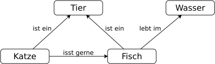

# Concept-Map
---

Mit einer **Concept-Map** werden Begriffe und ihre Zusammenhänge visualisiert.

Die Begriffe werden mit einem Rechteck umschlossen. Die Zusammenhänge zwischen zwei Begriffen werden durch einen beschrifteten Pfeil dargestellt.
