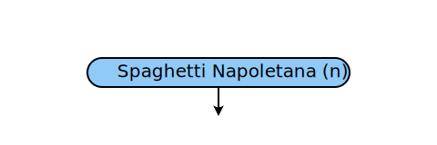
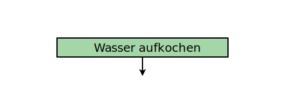
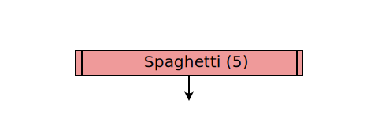
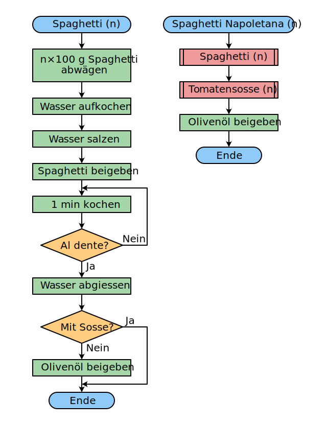

# Flussdiagramm
---

Ein **Flussdiagramm** (engl. *flowchart*) oder **Programmablaufplan** ist eine grafische Darstellungsform eines Algorithmus. Es besteht aus Elementen, welche einzelne Schritte des Algorithmus darstellen. Pfeile, welche die Elemente verbinden, geben die Reihenfolge an, in welcher die Schritte ausgeführt werden müssen.

## Elemente

Ein Flussdiagramm wird aus folgenden Grundelementen aufgebaut:

::: cards 3

#### Anfang
Der Anfang eines Ablaufs wird mit einem abgerundeten Rechteck markiert. Im Rechteck steht «Start» oder der Name des Unterprogramms.

***

#### Aktion
Eine normale Aktion oder Anweisung steht in einem Rechteck.

***

#### Ende
Das Ende eines Ablaufs wird mit einem abgerundeten Rechteck markiert. Im Rechteck steht «Ende».

***

#### Entscheidung

Eine Entscheidung wird in einer Raute dargestellt.

***

#### Aufruf

Der Aufruf eines Unterprogramms wird in einem Rechteck mit doppelten Seitenrändern dargestellt.
:::

## Beispiel

Das Flussdiagramm unten links beschreibt, wie Spaghetti gekocht werden. Das Flussdiagramm unten rechts beschreibt, wie Spaghetti Napoletana gekocht werden. Dabei wird der Spaghetti-Algorithmus mit einem **Aufruf** (rot) wiederverwendet.

