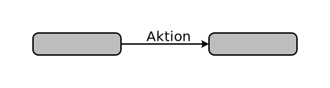
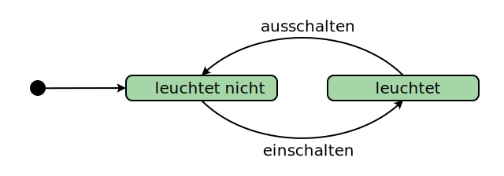

# Zustandsdiagramm
---

::: cards 2

#### Startzustand
Pro Zustandsdiagramm gibt es genau einen Startzustand. Von diesem aus muss genau eine Transition zu einem anderen Zustand gehen.
***

#### Endzustand
Ein Endzustand hat keine ausgehenden Transitionen. Wenn er erreicht wird, ist das Gerät ausgeschaltet oder «abgestürzt».
***

#### Zustand
Ein normaler Zustand kann eine oder mehrere eingehenden und ausgehenden Transitionen besitzen. Der Zustand erhält eine möglichst sprechende Bezeichnung.
***

#### Transition
Eine Transition ist ein Übergang zwischen zwei Zuständen. Sie wird mit der **Aktion**, welche diese Transition auslöst, beschriftet.
:::

## Lampe

Hier ist ein einfaches Beispiel eines Zustandsdiagramms, welches eine Lampe beschreibt. Am Anfang ist die Lampe ausgeschaltet (Anfangszustand führt zu Zustand «leuchtet nicht»). Durch die Aktion «einschalten» geht die Lampe vom Zustand «leuchtet nicht» in den Zustand «leuchtet» über.

