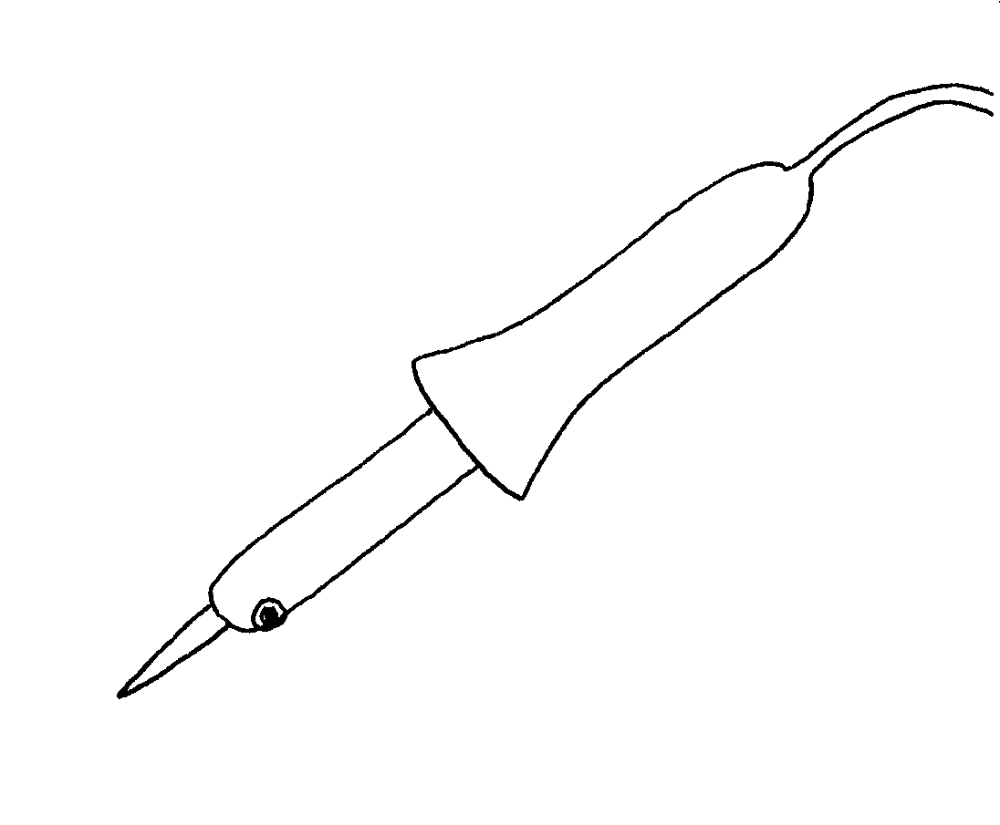
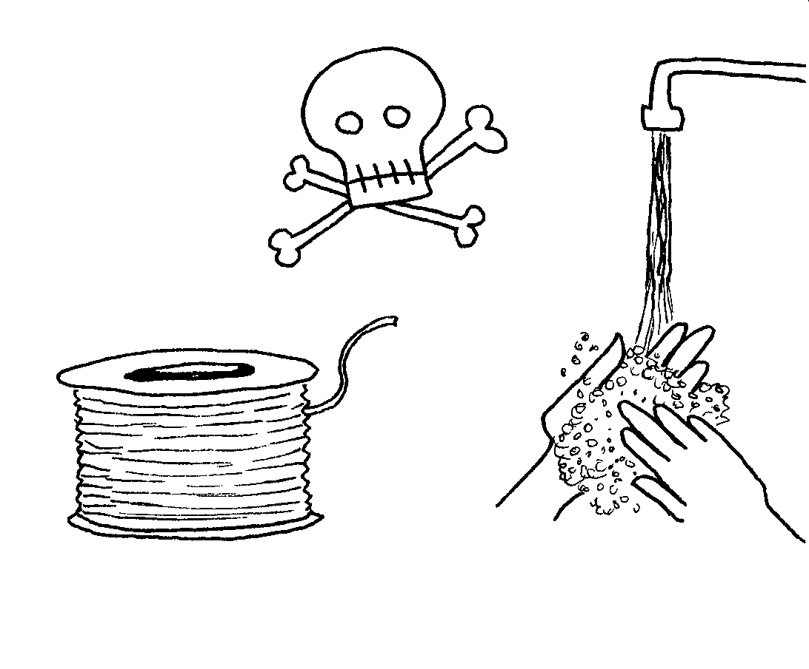
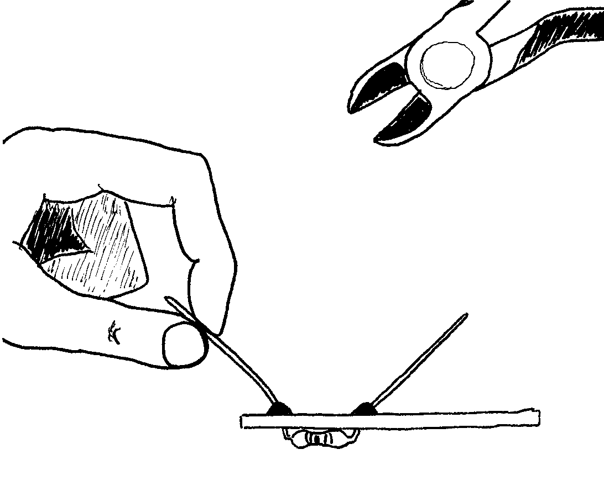

# Löten
---

## Sicherheitsregeln

::: cards 3

**Die Spitze ist heiss**

Dies ist ein Lötkolben. Die Spitze wird heiss genug, um den Lötzinn zu schmelzen. So ungefähr 400 Grad Celsius!

***

**Blei ist giftig**

Es festigt sich auf deiner Haut, während du den Lötzinn hältst. Also wasch deine Hände nach dem Löten!

***

**Drahtstücke sind Geschosse**

Halte den Draht, den du schneidest, immer mit einer Hand fest, damit das abgetrennte Drahtende nicht in einem Auge landet.
:::

* [:pdf: Löten ist einfach](loeten-ist-einfach.pdf)
* [:pdf: Soldering is easy](soldering-is-easy.pdf)
