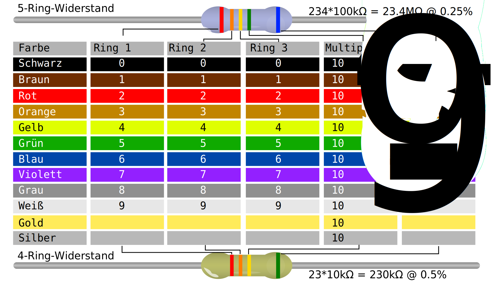
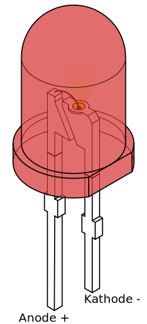

# Grundlagen Elektronik
---

## Spannungsquelle
Die Spannungsquelle «pumpt» Ladungen von Pluspol («3V») zum Minuspol («GND»), in Richtung der sogenannt «technischen Stromrichtung».
Die Spannungsquelle versorgt die Schaltung mit einer möglichst konstanten Spannung. Bei elektronischen Geräten ist dies meist ein Akku oder ein USB-Anschluss. In einem Schaltplan wird die Spannungsquelle durch dieses Symbol dargestellt:

## Stromkreis
Ein Stromkreis entsteht, wenn mit elektrischen Bauteilen und Kabeln der Pluspol (Anschluss 3V) mit dem Minuspol (Anschluss GND) verbunden wird.
Aber Achtung: nicht nur mit Kabel verbinden, sonst gibt es einen Kurzschluss!
Gemäss dem **Ohmschen Gesetz** stehen die Spannung $U$, der Widerstand $R$ und der Strom $I$ in folgendem Verhältnis zueinander:

$$U = R\cdot I$$

| Formelzeichen | Grösse     | Einheit |
|:------------- |:---------- |:------- |
| $U$           | Spannung   | Volt    |
| $R$           | Widerstand | Ohm     |
| $I$           | Strom      | Ampère  |

::: warning Achtung
Die technische Stromrichtung ist der Bewegungsrichtung der Elektronen entgegengesetzt. In der Technik fliesst der Strom vom Plus- zum Minuspol.
:::

## Masse (GND)

Der negative Pol der Spannungsquelle wird als Masse oder GND (engl. *ground*) bezeichnet. Der dient als Bezugspunkt für **Spannungsmessungen**. Ein Teil des Stromkreises, welcher direkt mit der Masse verbunden ist, hat also immer eine Spannung 0 Volt.

## Widerstand
Ein Widerstand ist ein elektronisches Bauteil, welches einen klar definierten ohmschen Widerstand in Schaltungen realisiert. In einem Schaltplan wird ein Widerstand durch folgendes Symbol dargestellt:

Ein Widerstand hemmt die Ladungen beim Durchgang, je nach Grösse des Widerstands.
  * ein temperaturunabhängiger Widerstand wird "ohmscher Widerstand" genannt
  * ein über einen Drehknopf variablen ohmscher Widerstand wird "Potentiometer" genannt
  * ein temperaturabhängiger Widerstand wird "Termistor" genannt

Der Widerstandswert in Ohm wird durch die Farbringe gekennzeichnet.
Jeder Farbe ist eine Zahl zwischen -2 und 9 zugeordnet.

## Leuchtdiode
- Eine Leuchtdiode (engl. light emitting diode, LED) erzeugt Licht, wenn durch sie Strom hindurchfliesst.
- Der Strom kann nur in einer Richtung durch eine Diode fliessen, von Anode zu Kathode, in die andere Richtung ist er blockiert.
- Eine Leuchtdiode muss immer mit einem Widerstand in Serie geschaltet werden, damit kein zu grosser Strom fliesst.

In einem Schaltplan wird eine Leuchtdiode durch folgendes Symbol dargestellt:

Eine «normale» rote Leuchtdiode benötigt eine Spannung von 1.6 V und kann einen maximalen Strom von 20 mA verkraften.

## Vorwiderstand

Um den Strom klein zu halten, muss eine Schaltung mit einer Leuchtdiode durch einen Widerstand ergänzt werden.

Der benötigte Widerstand berechnet sich so:

$$R_V = \frac{U_V}{I} = \frac{U - U_L}{I}$$

| Formelzeichen | Bedeutung                     |
|:------------- |:----------------------------- |
| $R_V$         | Widerstand                    |
| $U_V$         | Spannung über dem Widerstand  |
| $I$           | Strom                         |
| $U$           | Gesamtspannung                |
| $U_L$         | Spannung über der Leuchtdiode |

::: task Einfache Schaltung mit Leuchtdiode
1. Berechne den benötigten Vorwiderstand für eine rote Leuchtdiode (20 mA, 1.6 V) bei einer 3.3&nbsp;V- sowie bei einer 5&nbsp;V-Spannungsquelle.
2. Vergleiche Deine Lösung mit der Musterlösung.
3. Bringe eine Leuchtdiode zum Leuchten, indem Du den obenstehenden Schaltkreis realisierst, also eine Leuchtdiode mit Vorwiderstand an der Spannungsquelle (zwischen 3V und GND) anschliesst
***
- Der Vorwiderstand muss bei 3.3 V mindestens 77 Ohm betragen.
- Bei 5 V muss der Vorwiderstand mindestens 170 Ohm betragen.
:::

## Kabel

Ein Kabel leitet die Ladungen fast beliebig gut, es hat einen sehr kleinen elektrischen Widerstand (deshalb aufpassen wegen Kurzschluss).
