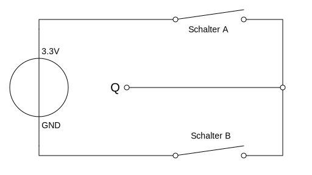

# Digitale Schaltung
---

Eine digitale Schaltung ist ein Stromkreis, bei welchem die **Spannung konstant** und der **Strom klein** ist.

## Logikpegel

In einer digitalen Schaltung wird jedem Punkt der Schaltung ein binärer Wert zugeordnet. Dazu wird die Spannung in diesem Punkt gemessen. Liegt die Spannung unter einer bestimmten Schwelle, so wird diesem Punkt der binäre Wert 0 zugeordnet, ansonsten der Wert 1.

Für die bei uns verwendete 3.3-Volt-Logik liegt dieser Schwellwert bei 2 Volt.

 

In der obenstehenden Schaltung wird die Spannung am Punkt Q gemessen, symbolisiert durch das «V» im Kreis.

Wird der Schalter B geschlossen, so ist im Punkt Q eine Spannung von 0 Volt vorhanden, somit hat der Punkt den binären Wert 0. Wird der Schalter A geschlossen, so ist bei Q eine Spannung von 3.3 Volt vorhanden und Q hat den binären Wert 1.

Werden beide Schalter geschlossen, so entsteht ein Kurzschluss und es ist keine Aussage über den binären Wert möglich.

Wird kein Schalter geschlossen, ist Q hochohmig. In diesem Fall kann die Spannung im Punkt Q nicht ermittelt werden und es ist ebenfalls keine Aussage über den binären Wert möglich.

Wir fassen zusammen:

| Schalter A  | Schalter B  | Spannung bei Q | binärer Wert |
|:----------- |:----------- |:-------------- |:------------ |
| offen       | offen       | hochohmig      | undefiniert  |
| offen       | geschlossen | 0 Volt         | 0            |
| offen       | geschlossen | 3.3 Volt       | 1            |
| geschlossen | geschlossen | Kurzschluss    | undefiniert  |
