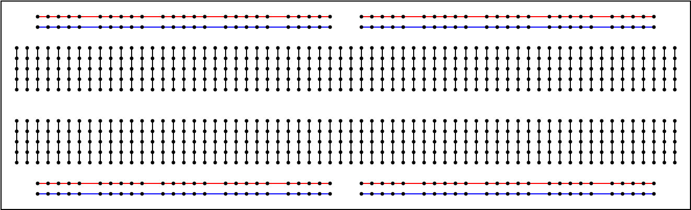

# Steckplatine
---

Eine Steckplatine (engl. *breadboard*) wird verwendet, um einen Prototyp einer Schaltung aufzubauen, ohne löten zu müssen.

Auf der Steckplatine sind jeweils fünf der inneren Kontakte vertikal miteinander verbunden.

Die äusseren Kontakte sind wie oben abgebildet horizontal miteinander verbunden und mit den Farben blau bzw. rot markiert. Üblicherweise wird für die **Versorgungsspannung** die Farbe **Rot** verwendet und für die **Masse** die Farbe **Blau**.
