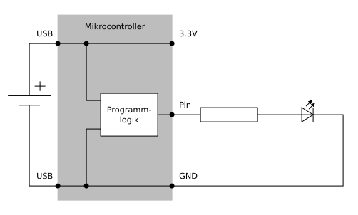
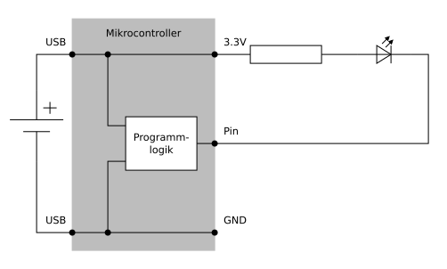

# Digitale Ausgabe
---

Bei der digitalen Ausgabe wird ein binärer Wert in eine entsprechende Spannung an einem Anschluss umgesetzt. Der Wert 0 entspricht einer Spannung von 0 Volt, der Wert 1 einer Spannung von 3.3 Volt.

## Positive Logik (*active high*)

Bei diesem Ansatz übernimmt der programmierbare Anschluss die Rolle des positiven Pols. Das bedeutet, dass die gesteuerte Leuchtdiode leuchtet, wenn am Anschluss der binäre Wert 1 ausgegeben wird.

| binärer Wert | Spannung an Pin | Leuchtdiode |
| ------------ | --------------- | ----------- |
| 0            | 0 Volt          | aus         |
| 1            | 3.3 Volt        | ein         |

## Negative Logik (*active low*)

Hier wird der Anschluss als negativer Pol eingesetzt. Wenn am Anschluss der binäre Wert 0 ausgegeben wird, ist über der Leuchtdiode eine Spannung vorhanden und sie leuchtet. Wird hingegen eine 1 ausgegeben, leuchtet die Diode nicht.

| binärer Wert | Spannung an Pin | Leuchtdiode |
| ------------ | --------------- | ----------- |
| 0            | 0 Volt          | ein         |
| 1            | 3.3 Volt        | aus         |

::: exercise Aufgabe – Positive Logik
Erstelle die obenstehende Schaltung mit **positiver Logik** auf der Steckplatine. Schreibe ein Programm, welches die Leuchtdiode im Sekundentakt blinken lässt. Die Leuchtdiode soll also jeweils eine halbe Sekunde leuchten, dann eine halbe Sekunde nicht leuchten.
:::

::: exercise Aufgabe – Negative Logik
Baue die Schaltung und das Programm so um, dass sie nun mit **negativer Logik** funktionieren.
:::
