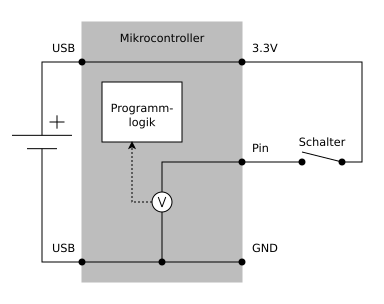
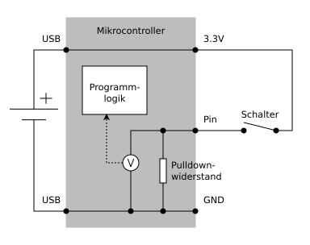
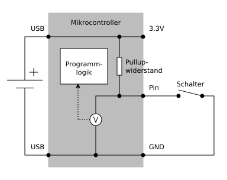

# Digitale Eingabe
---

Bei der digitalen Eingabe misst der Mikrocontroller die Spannung am Anschluss und übersetzt diese in den entsprechenden binären Wert.

In der untenstehenden Schaltung wird am Anschluss (Pin) der binäre Wert 1 ermittelt, falls der Schalter geschlossen wird. Wenn der Schalter offen ist, ist jedoch der Zustand des Pins hochohmig und es kann kein binärer Wert ermittelt werden.

Diese Situation muss in digitalen Schaltungen vermieden werden. Deshalb werden bei digitalen Eingängen sogenannte Pull-Widerstände eingesetzt, welche sicherstellen, dass am Anschluss immer eine definierte Spannung anliegt.

## Positive Logik (active high)

In der folgenden Schaltung ist zusätzlich ein Pulldown-Widerstand zwischen dem Pin und der Masse eingesetzt worden. Nun hat der Eingang eine Spannung von 0 Volt und somit einen definierten binären Wert, wenn der Schalter offen ist.

| Schalter    | Spannung an Pin | binärer Wert |
| ----------- | --------------- | ------------ |
| offen       | 0 Volt          | 0            |
| geschlossen | 3.3 Volt        | 1            |

## Negative Logik (active low)

Auch bei der Eingabe kann die Logik der Schaltung umgekehrt werden. Der Schalter wird mit der Masse verbunden und es wird ein Pullup-Widerstand verwendet, welcher den Eingang mit der Spannungsversorgung verbindet. Nun liefert der Eingang den binären Wert 1, falls der Schalter offen ist und 0, wenn der Schalter geschlossen wird.

| Schalter    | Spannung an Pin | binärer Wert |
| ----------- | --------------- | ------------ |
| offen       | 3.3 Volt        | 1            |
| geschlossen | 0 Volt          | 0            |

::: exercise Aufgabe – Positive Logik
Erstelle eine Schaltung mit einem Schalter und einer Leuchtdiode und ein entsprechendes Programm für folgende Funktionen:

1. Die Leuchtdiode brennt, wenn der Schalter gedrückt ist.
2. Die Leuchtdiode brennt, wenn der Schalter nicht gedrückt ist.
3. Die Leuchtdiode blinke, solange der Schalter (nicht) gedrückt ist.
4. Durch wiederholtes Drücken des Schalters wird die Leuchtdiode ein- und ausgeschaltet.
:::
