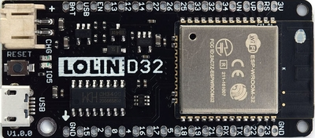
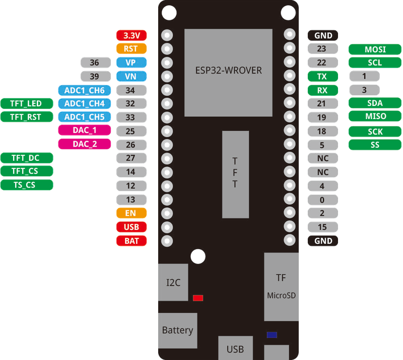

# WEMOS Lolin D32
---

Wemos Lolin ESP32 ist ein Mikrocontroller-Board, welches auf dem ESP32-Mikrocontroller basiert. Das Board hat folgende Features:

- WLAN-Schnittstelle
- Ladelogik für Lithium-Akku
- I2C-Schnittstelle
- SPI-Schnittstelle

## Pinbelegung

Am Pin 5 ist die eingebaute, blaue Leuchtdiode angeschlossen.

::: warning
#### Pin 12 nicht benutzen
Am Pin 12 darf nichts angeschlossen werden, sonst bootet der Mikrocontroller nicht mehr.
:::

## Treiber

Damit der Mikrocontroller von Windows oder macOS aus programmiert werden kann, muss der folgende Treiber installiert werden:

* [:link: CH340 Driver][1]

## Links

* [:link: Herstellerseite][2]
* [:link: Shop][3]

[1]: https://www.wemos.cc/en/latest/ch340_driver.html
[2]: https://www.wemos.cc/en/latest/d32/d32.html
[3]: https://www.bastelgarage.ch/esp8266-esp32/esp-boards/lolin-d32-esp32-board-4-mb-flash
