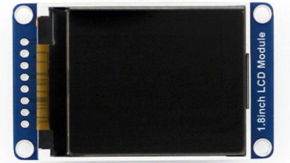

# Farb-LCD-Display 1.8"
---



* [:link: Shop][1]

## Technische Daten

| Beschreibung     |   Werte |
|:---------------- | -------:|
| Bildschirmgrösse |    1.8" |
| Breite in Pixel  |     128 |
| Höhe in Pixel    |     160 |
| Controller       | ST7735S |
| Anschluss        |     SPI |

## Anschluss

| Pin | Bedeutung             | ESP32 |
|:--- |:--------------------- | -----:|
| VCC | Stromversorgung 3.3 V |    3V |
| GND | Masse                 |   GND |
| DIN | SPI MOSI              |    23 |
| CLK | SPI Clock             |    18 |
| CS  | SPI Chip Select       |    ?? |
| DC  | Data/Command          |    ?? |
| RST | Reset                 |    ?? |
| BL  | Backlight             |    ?? |

## MicroPython

Um das Display verwenden zu können muss der folgende Treiber für MicroPython auf dem Mikrocontroller installiert werden:

* [:download: ST7735-Treiber für MicroPython](python/st7735.py)
* [:link: GitHub-Seite zu ST7735-Treiber][2]


[1]: https://www.bastelgarage.ch/128x160-1-8inch-lcd-display-modul
[2]: https://github.com/boochow/MicroPython-ST7735

### Initialisierung

Der Treiber muss in Python als Modul importiert werden:

``` python
import st7735
```

Nun kann mit der folgenden Anweisung ein Objekt erstellt werden, um mit dem Display zu kommunizieren:

~~~ python
anzeige = st7735.TFT(spi, dc, rst, cs)
~~~

TODO

``` python
spi = SPI(2, baudrate=20000000, polarity=0, phase=0, sck=Pin(14), mosi=Pin(13), miso=Pin(12))
anzeige = TFT(spi, dc, reset, cs)
anzeige.initr()
anzeige.rgb(True)
```

### Zeichnen

~~~ python
anzeige.fill(farbe)
~~~
füllt die ganze Anzeige in der angegebenen Farbe.

~~~ python
anzeige.pixel((x, y), farbe)
~~~
setzt den Pixel an den Koordinaten (`x`, `y`) auf die angegebene Farbe.

~~~ python
anzeige.text((x, y), text, farbe, groesse=1)
~~~
gibt den Text `text` an den Koordinaten (`x`, `y`) aus in der angegebenen Farbe aus. Mit `groesse=n` kann die Textgrösse angegeben werden.

~~~ python
anzeige.line((x1, y1), (x2, y2), farbe)
~~~
zeichnet eine Linie vom (`x1`, `y1`) nach (`x2`, `y2`) in der angegebenen Farbe.

~~~ python
anzeige.rect((x, y), (breite, hoehe), farbe)
~~~
zeichnet ein Rechteck in der angegebenen Farbe.

~~~ python
anzeige.fillrect((x, y), (breite, hoehe), farbe)
~~~
zeichnet ein ausgefülltes Rechteck in der angegebenen Farbe.

~~~ python
anzeige.circle((x, y), radius, farbe)
~~~
zeichnet einen Kreis in der angegebenen Farbe.

~~~ python
anzeige.fillcircle((x, y), radius, farbe)
~~~
zeichnet einen ausgefüllten Kreis in der angegebenen Farbe.
