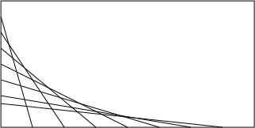

# Displays mit MicroPython
---

Um in MicroPython mit einem Display zu kommunizieren, muss ein Display-Objekt erstellt werden. Anschliessend können einheitliche Anweisungen verwendet werden.

## Display-Objekt erstellen

Das Erstellen des Display-Objekts hängt vom verwendeten Display ab:

* [OLED-Display 0.96"](?page=3-2-oled-0_96)
* [OLED-Display 1.3"](?page=3-3-oled-1_3)

## Display-Objekt verwenden

MicroPython bietet einheitliche Anweisungen, um Displays zu verwenden:

~~~ python
anzeige.fill(farbe)
~~~
füllt den ganzen Puffer mit der Farbe `farbe`. Für monochrome Displays ist `0` schwarz und `1` weiss.

~~~ python
anzeige.show()
~~~
schreibt den aktuellen Inhalt des Puffers auf das Display.

~~~ python
anzeige.text(text, x, y)
~~~
gibt bei den Koordinaten `x`, `y` den Text `text` aus.

~~~ python
anzeige.pixel(x, y, farbe)
~~~
setzt das Pixel an den Koordinaten `x`, `y` auf die Farbe `farbe`.

~~~ python
anzeige.hline(x, y, breite, farbe)
~~~
zeichnet eine horizontale Linie, welche beim Punkt `x`, `y` startet und `breite` Pixel lang ist.

~~~ python
anzeige.vline(x, y, hoehe, farbe)
~~~
zeichnet eine vertikale Linie, welche beim Punkt `x`, `y` startet und `hoehe` Pixel lang ist.

~~~ python
anzeige.line(x1, y1, x2, y2, farbe)
~~~
zeichnet eine Linie vom Punkt `x1`, `y1` zum Punkt `x2`, `y2`.

~~~ python
anzeige.rect(x, y, breite, hoehe, farbe)
~~~
zeichnet ein Rechteck an den angegebenen Koordinaten `x`, `y` mit der Breite `breite` und der Höhe `hoehe` in der Farbe `farbe.`

~~~ python
anzeige.fill_rect(x, y, breite, hoehe, farbe)
~~~
zeichnet ein gefülltes Rechteck an den angegebenen Koordinaten `x`, `y` mit der Breite `breite` und der Höhe `hoehe` in der Farbe `farbe.`

## Beispiel

``` python
import machine
import ssd1306
import time

breite = 128
hoehe = 64

scl = machine.Pin(22)
sda = machine.Pin(21)
i2c = machine.I2C(-1, scl, sda)

anzeige = ssd1306.SSD1306_I2C(breite, hoehe, i2c)

anzeige.fill(1)
anzeige.show()
time.sleep(1)

anzeige.fill(0)
anzeige.text("Hallo Welt!", 0, 0)
anzeige.rect(0, 10, 127, 20, 1)
anzeige.show()
```

::: exercise Aufgabe 1 – Display testen
Teste das obenstehende Beispiel.
:::


::: exercise Aufgabe 2 – Display kennenlernen
1. Schreibe ein Programm, welches folgendes Linienmuster auf dem Display erzeugt:

   

2. Schreibe ein Programm, welches eine Fortschrittsanzeige auf dem Display simuliert.
:::

::: exercise Aufgabe 3 – Interaktives Menü
Schreibe ein Programm, mit welchem sich ein Menü steuern lässt. Dazu benötigst du drei digitale Eingänge mit den folgenden Funktionen:

- nach oben
- nach unten
- Auswählen / OK

Mit dem Menü soll mindestens folgendes gemacht werden können:

- Grenzwert ändern
- Alarm ein-/ausschalten
:::
