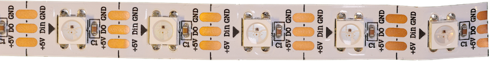

# NeoPixel
---



NeoPixel sind RGB-Leuchtdioden, welche über eine einzelne Datenleitung programmierbar sind.

* [:link: Shop][1]

## Anschluss

| Pin | Bedeutung              |   ESP32 |
|:--- |:---------------------- | -------:|
| +5V | Stromversorgung 5 Volt |     USB |
| Din | Datenleitung           | wählbar |
| GND | Masse                  |     GND |

## Stromverbrauch

Ein Neopixel hat bei voller Helligkeit einen Stromverbrauch von ca. 60 mA[^1].

## MicroPython

MicroPython enthält ein Modul, um NeoPixel zu programmieren. Es wird mit dem folgenden Befehl importiert:

``` python
import neopixel
```

~~~ python
np = neopixel.NeoPixel(pin, anzahl, timing=1)
~~~
erstellt ein Objekt, um die NeoPixel am angegebenen Anschluss `pin` anzusteuern. Mit `anzahl` wird angegeben, wie viele NeoPixel angesteuert werden sollen.

~~~ python
np[i] = (r, g, b)
~~~
setzt die Farbe des `i`-ten Pixels auf den angegebenen RGB-Wert.

~~~ python
np.write()
~~~
versendet die eingestellte Konfiguration an die NeoPixel.

## Vollständiges Beispiel

Im folgenden Beispiel werden 3 NeoPixel am Pin 4 angesteuert. Das erste Pixel wird Rot leuchten, das zweite Grün und das dritte Blau.

``` python ./neopixel_test.py
```

[1]: https://www.bastelgarage.ch/ws2812b-60led-m-led-neopixel-strip-0-165m
[^1]: Quelle: [XGadget](https://www.xgadget.de/anleitung/ws2812b-maximale-laenge-stromversorgung/)
