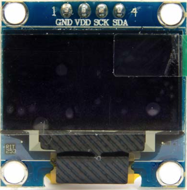

# OLED-Display 0.96"
---



* [:link: Shop][1]

## Technische Daten

| Beschreibung     |           Wert |
|:---------------- | --------------:|
| Bildschirmgrösse |          0.96" |
| Breite in Pixel  |            128 |
| Höhe in Pixel    |             64 |
| Controller       |        SSD1306 |
| Anschluss        | I<sup>2</sup>C |

## Anschluss

| Pin | Bedeutung                   | ESP32 |
|:--- |:--------------------------- | -----:|
| GND | Masse                       |   GND |
| VDD | Stromversorgung 3.3 bis 5 V |    3V |
| SCK | I<sup>2</sup>C Taktleitung  |    22 |
| SDA | I<sup>2</sup>C Datenleitung |    21 |

## MicroPython

Um das Display verwenden zu können muss der folgende Treiber für MicroPython auf dem Mikrocontroller installiert werden:

* [:download: SSD1306-Treiber für MicroPython](./ssd1306.py)
* [:link: GitHub-Seite zu SSD1306-Treiber][2]

Der Treiber muss in Python als Modul importiert werden:

``` python
import ssd1306
```

Nun kann mit der folgenden Anweisung ein Objekt erstellt werden, um mit dem Display zu kommunizieren:

~~~ python
display = ssd1306.SSD1306_I2C(breite, hoehe, i2c)
~~~
erzeugt ein Objekt, welches das Display repräsentiert. Dabei ist `breite` die Breite des Displays in Pixel, `hoehe` ist die Höhe des Displays in Pixel und `i2c` ist ein I<sup>2</sup>C-Bus.

Nun können die allgemeinen MicroPython-Anweisungen für Displays verwendet werden:

* [Display-Anweisungen von MicroPython](?page=../9-micropython/)

## Beispiel

Für das folgende Beispiel wird angenommen, dass ein ESP32-Mikrocontroller verwendet wird, bei welchem sich der I<sup>2</sup>C-Bus an den Pins 21 und 22 befindet:

``` python
import machine
import ssd1306

breite = 128
hoehe = 64

scl = machine.Pin(22)
sda = machine.Pin(21)
i2c = machine.I2C(-1, scl, sda)
anzeige = ssd1306.SSD1306_I2C(breite, hoehe, i2c)
```


[1]: https://www.bastelgarage.ch/oled-display-weiss-i2c-128x64-0-96
[2]: https://github.com/micropython/micropython/blob/master/drivers/display/ssd1306.py
