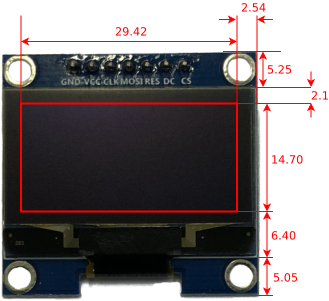

# OLED-Display 1.3"
---



* [:link: Shop][1]


## Technische Daten

| Beschreibung     |   Wert |
|:---------------- | ------:|
| Bildschirmgrösse |   1.3" |
| Breite in Pixel  |    128 |
| Höhe in Pixel    |     64 |
| Controller       | SH1106 |
| Anschluss        |    SPI |

## Anschluss

| Pin  | Bedeutung             |   ESP32 |
|:---- |:--------------------- | -------:|
| GND  | Masse                 |     GND |
| VCC  | Stromversorgung 3.3 V |      3V |
| CLK  | SPI Clock             |      18 |
| MOSI | SPI MOSI              |      23 |
| RES  | Reset                 | wählbar |
| DC   | Data/Control          | wählbar |
| CS   | SPI Chip Select       | wählbar |

## MicroPython

Um das Display verwenden zu können muss der folgende Treiber für MicroPython auf dem Mikrocontroller installiert werden:

* [:download: SH1106-Treiber für MicroPython](./sh1106.py)
* [:link: GitHub-Seite zu SH1106-Treiber][2]

Der Treiber muss in Python als Modul importiert werden:

``` python
import sh1106
```

Nun kann mit der folgenden Anweisung ein Objekt erstellt werden, um mit dem Display zu kommunizieren:

~~~ python
anzeige = sh1106.SH1106_SPI(breite, hoehe, spi, dc, res, cs)
~~~
erzeugt ein Objekt, welches das Display repräsentiert. Dabei ist `breite` die Breite des Displays in Pixel, `hoehe` ist die Höhe des Displays in Pixel und `spi` ist ein SPI-Bus. `dc`, `res` und `cs` sind die Pins, welche mit den entsprechenden Pins des Displays verbunden werden.

Nun können die allgemeinen MicroPython-Anweisungen für Displays verwendet werden:

* [Display-Anweisungen von MicroPython](?page=../9-micropython/)

Ausserdem stehen folgende speziellen Anweisungen zu Verfügung:

~~~ python
anzeige.contrast(helligkeit)
~~~
stellt die Helligkeit der Anzeige ein. Für `helligkeit` können Werte zwischen 0 (dunkel) und 255 (hell) angegeben werden.

~~~ python
anzeige.rotate(flag)
~~~
dreht die Anzeige um 180°, falls für `flag` der Wert `True` angegeben wird. Wird für `flag` der Wert `False` angegeben, wird die Anzeige normal dargestellt.

~~~ python
anzeige.sleep(flag)
~~~
schaltet das Display ein, falls für `flag` der Wert `True` angegeben wird. Wird für `flag` der Wert `False` angegeben, wird das Display in den Ruhezustand versetzt.


## Beispiel

Für das folgende Beispiel wird angenommen, dass ein ESP32-Mikrocontroller verwendet wird, bei welchem sich der SPI-Bus an den Pins 18, 19 und 23 befindet:

``` python
import machine
import sh1106

sck = machine.Pin(18)
mosi = machine.Pin(23)
miso = machine.Pin(19)
spi = machine.SPI(1, sck=sck, mosi=mosi, miso=miso)

dc = machine.Pin(27)
res = machine.Pin(14)
cs = machine.Pin(26)
anzeige = sh1106.SH1106_SPI(128, 64, spi, dc, res, cs)
```

[1]: https://www.play-zone.ch/de/oled-modul-1-3-128-x-64-pixel-spi-weiss-sh1106.html
[2]: https://github.com/robert-hh/SH1106
