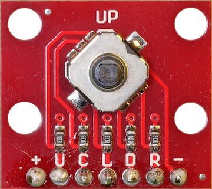

# Joystick
---



* [:link: Shop][1]

[1]: https://www.bastelgarage.ch/5-weg-mikro-joystick-breakout

## Anschluss


## MicroPython

Die Anschlüsse des Joysticks werden als digitale Eingänge angesteuert.

Der Joystick hat eine negative Logik, die Pins liefern also denn Wert `False`, wenn die Taste gedrückt ist und `True`, wenn sie nicht gedrückt ist.

### Dauerreaktion auf Tastendruck

``` python
import machine

up_pin = machine.Pin(34, machine.Pin.IN)

while True:
    if up_pin.value():
        # do something
```


### Einmalige Reaktion auf Tastendruck

``` python
import machine

up_pin = machine.Pin(34, machine.Pin.IN)
up_current = False
up_last = False

while True:
    up_current = not up_pin.value()
    if up_current and not up_last:
        # do something
    up_last = up_current
```
