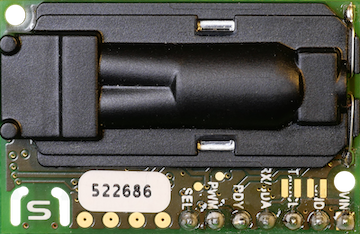

# SCD30 Kohlendioxidsensor
---

Der SCD30 ist ein Sensor, welcher den Kohlendioxidgehalt der Luft sowie Temperatur und Feuchtigkeit misst.



* [:link: Shop][1]

## Anschluss

| Pin | Bedeutung                           | ESP32 |
|:--- |:----------------------------------- | -----:|
| VCC | Stromversorgung 3.3 bis 5.5 V       |    3V |
| GND | Masse                               |   GND |
| SCL | I<sup>2</sup>C Taktleitung          |    22 |
| SDA | I<sup>2</sup>C Datenleitung         |    21 |
| RDY | Daten bereit                        |       |
| PWM | CO<sub>2</sub>-Konzentration analog |       |
| SEL | Auswahl Kommunikationsprotokoll     |       |

Mit einer hohen Spannung auf dem Pin **RDY** signalisiert der Sensor, dass Daten bereit zum Auslesen sind.

Mit einer hohen Spannung am Pin **SEL** kann auf das Kommunikationsprotokoll Modbus umgeschaltet werden.

## Messbereich

| Messwert     | Bereich            | Genauigkeit         |
|:------------ |:------------------ |:------------------- |
| Kohlendioxid | 400 bis 10'000 ppm | ± 30 ppm            |
| Feuchtigkeit | 0 bis 100 % RH     | ±3.0 % RH bei 25 °C |
| Temperatur   | -40 bis 70 °C      | ±0.4 °C             |


## MicroPython

Um den Sensor verwenden zu können muss der folgende Treiber für MicroPython auf dem Mikrocontroller installiert werden:

* [:download: SCD30-Treiber für MicroPython](./scd30.py)
* [:link: GitHub-Seite zu SCD30-Treiber][2]

Der Treiber muss in Python als Modul importiert werden:

``` python
import scd30
```

Nun kann mit der folgenden Anweisung ein Objekt erstellt werden, um mit dem Sensor zu kommunizieren:

~~~ python
sensor = scd30.SCD30(i2c, addr, pause=delay)
~~~
erzeugt ein Objekt, welches das Display repräsentiert. Dabei ist `i2c` ist ein I<sup>2</sup>C-Bus und `addr` ist die I<sup>2</sup>C-Adresse des Sensors.

Mit `pause=` kann angegeben werden, wie viele Mikrosekunden nach einem Befehl auf die Antwort gewartet werden soll. Dieser Wert sollte auf mindestens 10 Millisekunden, also `10000` gesetzt werden, damit nicht zu viele Kommunikationsfehler auftreten.

~~~ python
sensor.soft_reset()
~~~
führt einen Reset des Sensors durch.

~~~ python
sensor.get_firmware_version()
~~~
liefert die aktuelle Firmware-Version des Sensors zurück.

~~~ python
sensor.set_measurement_interval(seconds)
~~~
legt das Intervall zwischen zwei Messungen auf `seconds` Sekunden fest.

~~~ python
sensor.get_measurement_interval()
~~~
liefert das aktuelle eingestellte Intervall zwischen zwei Messungen in Sekunden zurück.

~~~ python
sensor.start_continous_measurement()
~~~
beginnt, im angegebenen Intervall regelmässig Messungen durchzuführen.

~~~ python
sensor.get_status_ready()
~~~
liefert `1`, wenn eine Messung bereit zum Auslesen ist. Ansonsten wird ein anderer Wert zurückgeliefert. Diese Anweisung kann einen Fehler verursachen, wenn der Sensor nicht schnell genug antwortet. Deshalb sollte ein etwaiger Fehler immer abgefangen werden:

``` python
try:
    ready = sensor.get_status_ready() == 1
except:
    ready = False
```

~~~ python
co2, temp, hum = sensor.read_measurement()
~~~
liest die Werte der letzten Messung aus. Es wird ein Tupel bestehend aus drei Werten zurückgeliefert. Der erste Wert `co2` ist die gemessene CO<sub>2</sub>-Konzentration in ppm, der zweite Wert `temp` die Temperatur in °C und der dritte Wert `hum` die relative Luftfeuchtigkeit in %.

## Beispiel

Für das folgende Beispiel wird angenommen, dass ein ESP32-Mikrocontroller verwendet wird, bei welchem sich der I<sup>2</sup>C-Bus an den Pins 21 und 22 befindet:

``` python ./scd30_example.py
```

[1]: https://www.mouser.ch/ProductDetail/?qs=sGAEpiMZZMve4%2FbfQkoj%252BKTXH1e2FQdCU1EEDcnGCNw%3D
[2]: https://github.com/agners/micropython-scd30
