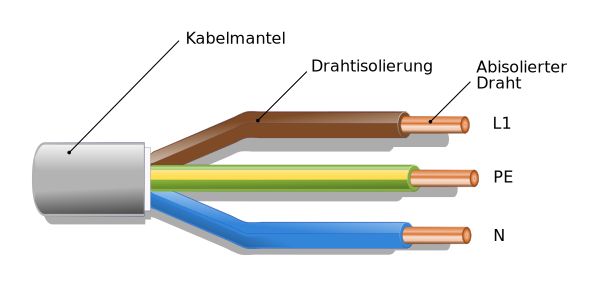
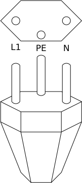

# Stromanschluss
---

::: box warning
#### :warning: Achtung
Der unsachgemässe Umgang mit Elektroinstallationen ist gefährlich und kann tödlich sein!
:::

## Elektrokabel

Elektrokabel im Haushalt haben drei Adern, die durch verschiedene Farben gekennzeichnet sind:

| Farbe     | Bezeichnung   | Kurz |
|:--------- |:------------- |:---- |
| Braun     | Phase 1       | L1   |
| Blau      | Neutralleiter | N    |
| Gelb/Grün | Schutzleiter  | PE   |

Die braune Ader ist die **Phase 1**. Sie ist stromführend und versorgt das angeschlossene Gerät mit Spannung.

Die blaue Ader ist der **Neutralleiter** oder **Nullleiter**. Sie führt den Strom vom Gerät zur Spannungsquelle zurück.

Die gelb-grüne Ader ist der **Schutzleiter** oder die **Erdung**. Sie stellt eine Verbindung vom Gehäuse des Geräts zur Erde her und schützt somit vor Berührungsspannungen.

## Steckdosen

Bei Steckdosen und Steckern nach der Schweizer Norm SEV 1011 ist der mittlere, nach unten versetzte Kontaktstift der Schutzleiter. Der linke Stift führt die Phase 1 und der rechte Stift ist der Neutralleiter.

