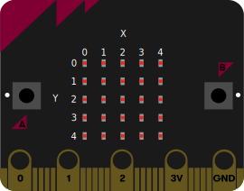

# Display
---

Das Display des micro:bit besteht aus 5×5 Leuchtdioden. Auf der folgenden Abbildung ist das Koordinatensystem des Displays abgebildet:



~~~ python
display.clear()
~~~
schaltet alle Leuchtdioden des Displays aus.

``` python
from microbit import *

display.clear()
```

~~~ python
display.scroll(wert, delay=150, wait=True, loop=False)
~~~
stellt einen **scrollenden Text** auf dem Display dar. Die Parameter haben folgende Bedeutung:

| Bezeichnung | Typ             | Bedeutung                                     |
| ----------- | --------------- | --------------------------------------------- |
| `wert`      | beliebiger Wert | Der darzustellende Wert                       |
| `delay=`    | Zahl            | Millisekunden Wartezeit vor nächstem Scrollen |
| `wait=`     | Wahrheitswert   | Befehl wartet, bis fertig gescrollt wurde     |
| `loop=`     | Wahrheitswert   | Animation wird endlos wiederholt              |

``` python
from microbit import *

display.scroll("Hallo Welt!")
display.scroll("Bye bye", delay=300, wait=False)
```

~~~ python
display.show(bild)
~~~
zeigt ein Bild an. Für `bild` muss ein [Image](?page=ref-image)-Wert angegeben werde.

``` python
from microbit import *

display.show(Image.PACMAN)
```

Es können aber auch eigene Bilder definiert werden.

~~~ python
display.show(wert, delay=400, wait=True, loop=False, clear=False)
~~~
spielt eine Animation ab. Falls `wert` ein Text oder eine Zahl ist, dann werden die einzelnen Zeichen oder Ziffern nacheinander angezeigt. Wenn `wert` eine Liste von Bildern ist, werden diese der Reihe nach angezeigt.

Die zusätzlichen Parameter haben folgende Bedeutung:

| Bezeichnung | Werte         | Bedeutung                                     |
|:----------- |:------------- |:--------------------------------------------- |
| `delay`     | Zahl          | Millisekunden Wartezeit zwischen zwei Bildern |
| `wait`      | Wahrheitswert | Befehl wartet, bis Animation fertig ist       |
| `loop`      | Wahrheitswert | Animation wird endlos wiederholt              |
| `clear`     | Wahrheitswert | Display wird nach letztem Bild gelöscht       |

## Einzelne Pixel ein-/ausschalten

Mit der Funktion `set_pixel()` kann die Helligkeit einer einzelnen Leuchtdiode gesteuert werden.

~~~ python
display.set_pixel(x, y, helligkeit)
~~~
legt die Helligkeit der Leuchtdiode an den Koordinaten `x` und `y` des Displays fest. Für `helligkeit` wird eine Zahl zwischen `0` (ausgeschaltet) und `9` (ganz hell) angegeben.

~~~ python
display.get_pixel(x, y)
~~~
liefert die aktuelle Helligkeit der Leuchtdiode an den Koordinaten `x` und `y` des Displays zurück. Der zurückgelieferte Wert liegt zwischen `0` (ausgeschaltet) und `9` (ganz hell).

~~~ python
display.off()
~~~
schaltet das Display ganz aus.

~~~ python
display.on()
~~~
schaltet das Display wieder an.

~~~ python
display.is_on()
~~~
überprüft, ob das Display eingeschaltet ist.
