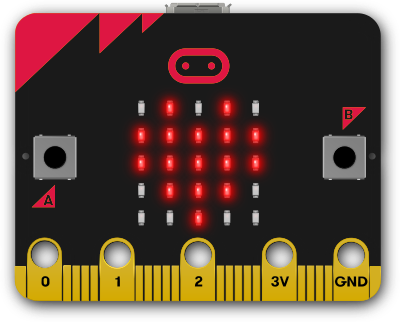

# :reference: micro:bit
---




## Python auf dem micro:bit

Um auf Hardware des micro:bit zugreifen zu können, muss erst das Modul `microbit` in das Python-Skript importiert werden. Dies geschieht mit der Anweisung

``` python
from microbit import *
```

Nach dieser Anweisung stehen im Skript die folgenden Objekte zu Verfügung. Sie repräsentieren je ein Teil der Hardware des micro:bit.

| Objekt          | Funktion                                   | zusätzliche Funktion |
|:--------------- |:------------------------------------------ | --------------------:|
| `accelerometer` | [Beschleunigungssensor][11]                |                      |
| `button_a`      | [linke Taste][12]                          |                      |
| `button_b`      | [rechte Taste][12]                         |                      |
| `compass`       | [Magnetometer (Kompass)][13]               |                      |
| `display`       | [5x5 LED-Matrix][14]                       |                      |
| `pin0`          | [digitaler][15] / [analoger][16] Anschluss |          Touch-Taste |
| `pin1`          | [digitaler][15] / [analoger][16] Anschluss |          Touch-Taste |
| `pin2`          | [digitaler][15] / [analoger][16] Anschluss |          Touch-Taste |
| `pin3`          | [digitaler][15] / [analoger][16] Anschluss |              Display |
| `pin4`          | [digitaler][15] / [analoger][16] Anschluss |              Display |
| `pin6`          | [digitaler][15] Anschluss                  |              Display |
| `pin7`          | [digitaler][15] Anschluss                  |              Display |
| `pin8`          | [digitaler][15] Anschluss                  |                      |
| `pin9`          | [digitaler][15] Anschluss                  |              Display |
| `pin10`         | [digitaler][15] / [analoger][16] Anschluss |              Display |
| `pin12`         | [digitaler][15] Anschluss                  |                      |
| `pin13`         | [digitaler][15] Anschluss                  |             SPI MOSI |
| `pin14`         | [digitaler][15] Anschluss                  |             SPI MISO |
| `pin15`         | [digitaler][15] Anschluss                  |              SPI SCK |
| `pin16`         | [digitaler][15] Anschluss                  |                      |
| `pin19`         | [digitaler][15] Anschluss                  |              I2C SCL |
| `pin20`         | [digitaler][15] Anschluss                  |              I2C SDA |
| `radio`         | [Funk][17]                                 |                      |

## Links

* [:link: BCC micro:bit Dokumentation][1]
* [:link: 101 Computing: Projektideen][2]

[1]: https://microbit-micropython.readthedocs.io/en/latest/
[2]: https://www.101computing.net/category/bbc-microbit/

[11]: ?page=5-accelerometer
[12]: ?page=4-buttons
[13]: ?page=6-compass
[14]: ?page=2-display
[15]: ?page=7-digital-io
[16]: ?page=8-analog-io
[17]: ?page=9-radio
