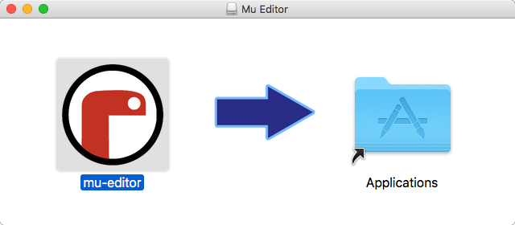
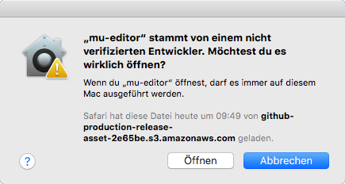

# Installation
---

Auf der Webseite vom Mu stehen Installationsprogramme für Windows und macOS zu Verfügung. Mit einem der folgenden Links kann das gewünschte Installationsprogramm direkt heruntergeladen werden:

* [:link: Offizielle Webseite der Mu Editors][1]

In den folgenden Abschnitten wird die Installation schrittweise erklärt.

## :mdi-microsoft-windows: Installation auf Windows

Lade den Mu Editor für Windows herunter und installiere ihn:

* [:mdi-download: Mu 1.1.0 alpha 2 für Windows][2]

## :mdi-apple: Installation macOS

1. Lade den Mu Editor für macOS herunter:

    * [:mdi'download: Mu 1.1.0 alpha 2 für macOS][1]

2. Öffne die Instalationsdatei und ziehe den Mu Editor in das _Applications_-Verzeichnis

    

3. Starte den Mu Editor.

    

[1]: https://codewith.mu/
[2]: https://github.com/mu-editor/mu/releases/download/1.1.0-alpha.2/mu-editor_1.1.0-alpha.2_win64.exe
[3]: https://github.com/mu-editor/mu/releases/download/1.1.0-alpha.2/mu-editor_1.1.0-alpha.2_osx.dmg
