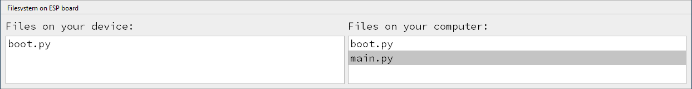

# Modus ESP MicroPython
---

Im Modus ESP MicroPyhon können ESP-Mikrocontroller programmiert werden.

| Icon                  | Beschreibung                                                             |
|:--------------------- |:------------------------------------------------------------------------ |
|      | aktuelle Programm auf dem Mikrocontroller starten                        |
|     | interaktive Python-Konsole (REPL) des Mikrocontrollers öffnen/schliessen |
|    | Dateimanager öffnen/schliessen                                           |
|  | grafischen Datenplotter öffnen                                           |

## Dateimanager

Mit dem Dateimanager können Dateien zwischen Computer und Mikrocontroller hin- und herkopiert werden.

Auf der linken Seite werden die Dateien auf dem Mikrocontroller angezeigt, auf der rechten Seite die Dateien im **mu_code**-Verzeichnis auf dem Computer.

Dateien können durch Ziehen auf die andere Seite kopiert werden.
