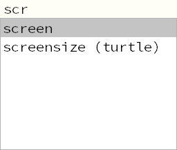

# Code-Vervollständigung
---

Die Code-Vervollständigung (engl. *code completion*) ist ein hilfreiches Werkzeug beim Programmieren, das von vielen Editoren zur Verfügung gestellt wird.

In Mu erscheint beim Schreiben nach mindestens zwei Buchstaben eine Liste von möglichen Ergänzungen, welche an dieser Stelle sinnvoll sind. Wenn beispielsweise `scr` geschrieben wird, erscheint eine Liste mit den Vorschlägen `screen` und `screensize`:

Nun kann mit den Pfeiltasten [Up] und [Down] der gewünschte Eintrag gesucht und mit [Enter] eingefügt werden. Ein Eintrag kann auch durch einen _Doppelklick_ eingefügt werden.
