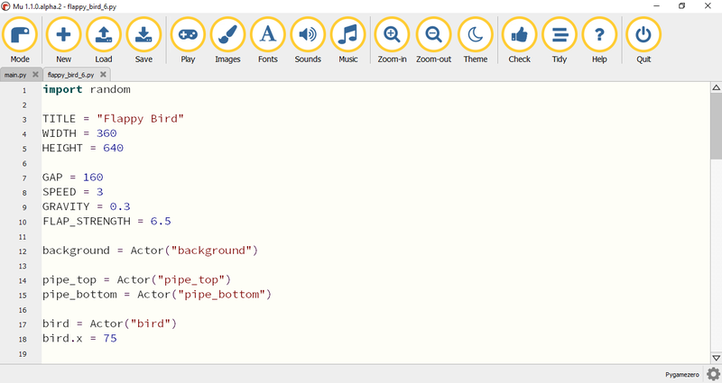
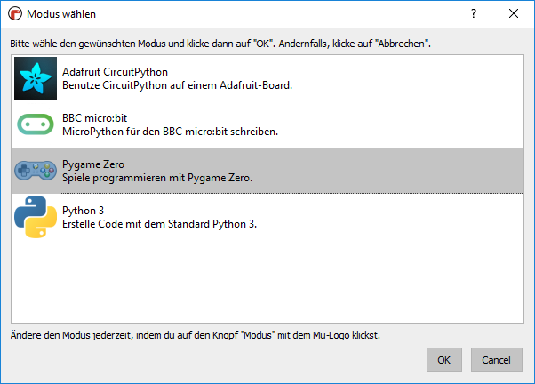

# :reference: Mu-Editor
---

Wir verwenden für die Programmierung den **Mu**-Editor:

## Befehle

Der Mu Editor hat ein relativ einfaches Menü. Die meisten Befehle stehen in jedem Modus zu Verfügung. Sie sind in der folgenden Tabelle aufgeführt. Die Befehle zwischen **Save** und **Zoom-in** ändern sich je nach Modus. Sie werden beim entsprechenden Modus erklärt.

| Icon                        | Beschreibung                                   |
|:--------------------------- |:---------------------------------------------- |
|     | eine Liste aller Modi anzeigen                 |
|       | ein neues Python-Programm erstellen            |
|      | eine gespeichertes Python-Programm laden       |
|      | das aktuelle Python-Programm speichern         |
|   | die Schrift vergrössern                        |
|  | die Schrift verkleinern                        |
|     | das Aussehen ändern                            |
|     | das aktuelle Programm auf Fehler überprüfen    |
|      | den aktuellen Programmcode  sauber formatieren |
|      | Webseite mit Anleitungen (auf Englisch) öffnen |
|      | das Programm schliessen                        |

## Modus

Beim ersten Start von Mu muss ein Modus ausgewählt werden. Der Modus kann jederzeit mit dem Menüpunkt _Mode_ gewechselt werden.

## Speichern unter

Der Mu Editor unterstützt das Speichern unter einem neuen Dateinamen nicht. Um ein Python-Skript unter einem neuen Dateinamen zu speichern, geht man am besten so vor:

| Aktion                   | Tastenkombination |
| ------------------------ | -----------------:|
| Alles auswählen          |        [Ctrl]+[A] |
| Kopieren                 |        [Ctrl]+[C] |
| neues Programm erstellen |        [Ctrl]+[N] |
| Einfügen                 |        [Ctrl]+[V] |
| Speichern                |        [Ctrl]+[S] |
