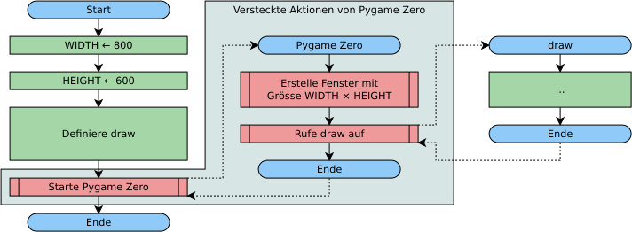
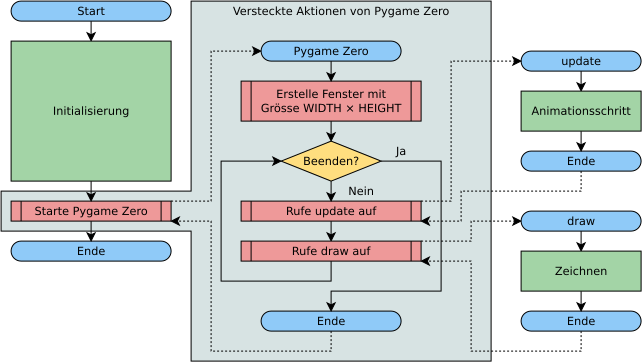

# Animation
---

~~~ python
def draw():
~~~
wird von Pygame Zero aufgerufen. Hier wird gezeichnet.

~~~ python
def update():
~~~
wird von Pygame Zero aufgerufen. Hier wird der nächste Animationsschritt berechnet.

## Start von Pygame Zero

Im Pygame Zero-Modus des Mu Editors wird Pygame Zero automatisch gestartet, sobald das eigene Skript fertig abgearbeitet worden ist.

In einem anderen Editor muss Pygame Zero durch einen Befehl am Ende des eigenen Skripts gestartet werden. Dazu muss das Modul `pgzrun` importiert werden:

``` python
import pgzrun

# Eigene Befehle ...

pgzrun.go()
```

## Funktionsweise von Pygame Zero ohne Animation

Das Hauptprogramm von Pygame Zero wird erst gestartet, nachdem das ganze Skript abgearbeitet worden ist. Dafür sorgt der spezielle Modus des Mu-Editors.

Pygame Zero erstellt zunächst ein Fenster. Dazu werden die aktuellen Angaben in den Variablen `WIDTH` und `HEIGHT` verwendet. Anschliessend ruft Pygame Zero das Unterprogramm `draw()` auf, welches im eignen Skript definiert worden ist.



``` python
import pgzrun

WEISS = (255, 255, 255)
SCHWARZ = (0, 0, 0)

def draw():
    screen.fill(WEISS)
    screen.draw.text("Hallo Welt", top=10, left=10, color=SCHWARZ)

pgzrun.go()
```


## Funktionsweise von Pygame Zero mit Animation

Falls im eigenen Skript ein Unterprogramm mit dem Namem `update` definiert wird, geht Pygame Zero davon aus, dass es sich um eine Animation handelt. Die Funktionsweise von Pygame Zero ändert sich entsprechend:

Pygame Zero erstellt zunächst ein Fenster. Dazu werden die aktuellen Angaben in den Variablen `TITLE`, `WIDTH` und `HEIGHT` verwendet.

Anschliessend startet Pygame Zero den sogenannten *Game Loop*. Dabei wird erst das Unterprogramm `update` aufgerufen und anschliessend `draw`. Dies wird so lange wiederholt, bis das Programm abgebrochen wird.




``` python ./animation.py
```
