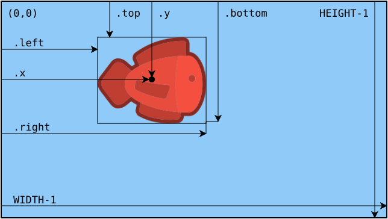

# Aktor
---

## Grundlegendes

~~~ python
nemo = Actor(bild)
~~~
erstellt einen neuen Aktor. `bild` ist der Name einer Bilddatei.

~~~ python
nemo.draw()
~~~
zeichnet den Aktor `nemo` in das Fenster.

## Position



~~~ python
nemo.bottom
~~~
ist die y-Koordinate des unteren Rands von `nemo`.

~~~ python
nemo.left
~~~
ist die x-Koordinate des linken Rands von `nemo`.

~~~ python
nemo.right
~~~
ist die x-Koordinate des rechten Rands von `nemo`.

~~~ python
nemo.top
~~~
ist die y-Koordinate des oberen Rands von `nemo`.

~~~ python
nemo.x
~~~
ist die x-Koordinate des Ankers von `nemo`.

~~~ python
nemo.y
~~~
ist die y-Koordinate des Ankers von `nemo`.

~~~ python
nemo.angle
~~~
ist die Rotation von `nemo` in Grad im Gegenuhrzeigersinn.

## Kollision

~~~ python
nemo.collidepoint(x, y)
~~~
überprüft, ob `nemo` mit dem Punkt mit den Koordinaten `x`, `y` kollidiert.

~~~ python
nemo.collidepoint(pos)
~~~
überprüft, ob `nemo` mit dem Punkt mit den Punkt `pos` kollidiert. So kann beispielsweise überprüft werden, ob ein Aktor mit der Maus angeklickt wird:

``` python
def on_mouse_down(pos):
    if nemo.collidepoint(pos):
        print("Nemo mit Maus berührt.")
```

~~~ python
nemo.colliderect(dory)
~~~
überprüft, ob `nemo` mit `dory` kollidiert.

~~~ python
nemo.collidelist(liste)
~~~
überprüft, ob `nemo` mit einem Aktor in der Liste `liste` kollidiert. In dem Fall wird der Index des kollidierenden Aktors in der Liste zurückgeliefert. Wenn kein Aktor der Liste mit `nemo` kollidiert, wird `-1` zurückgeliefert.

## Messung

~~~ python
nemo.distance_to(dory)
~~~
misst die Distanz zwischen `nemo` und `dory`.

~~~ python
nemo.angle_to(dory)
~~~
misst den Winkel von `nemo` aus in Richtung `dory`.
