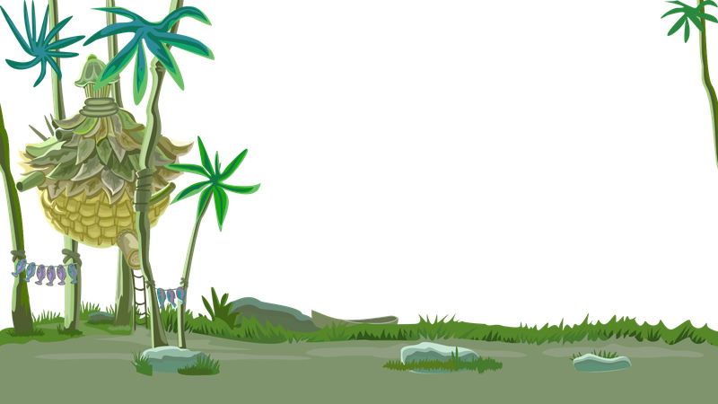

# Parallax-Scrolling
---

## Bilder

::: columns 4

***

***

***

***

***

***

:::

Bildquelle: [Craftpix.net, OpenGameArt][1], Lizenz: OGA

## Code

``` python samples/parallax_scrolling.py
```

[1]: https://opengameart.org/content/fairy-tale-2d-backgrounds
