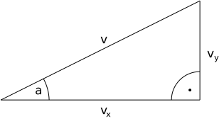

# Geschoss
---

## Schuss auslösen

Ein Geschoss ist ein Aktor, der sich nicht von Anfang an bewegt. Der Aktor muss sich somit merken, ob er schon «existiert». Dies kann erreicht werden, indem eine Variable `geschoss.aktiv` definiert wird:

``` python
geschoss = Actor("laser")
geschoss.aktiv = False
```

Der Schuss wird nur gezeichnet, wenn er aktiv ist:
``` python
def draw():
    if geschoss.aktiv:
        geschoss.draw()
```

Wenn der Schuss ausgelöst wird, wird er «aktiviert». Der Schuss wird an die Stelle gesetzt, wo sich das Objekt befindet, welches den Schuss abgibt:
```
def schiesse():
    geschoss.x = raumschiff.x
    geschoss.y = raumschiff.y
    geschoss.vx = 2
    geschoss.vy = 0
    geschoss.aktiv = True
```

## Schussrichtung

Damit sich der Schuss in die richtige Richtung bewegt, müssen die horizontale und vertikale Geschwindigkeit des Geschosses $v_x$ und $v_y$ ausgerechnet werden. Bekannt sind die gewünschte Geschwindigkeit $v$ und der Winkel $a$:



Im rechtwinkligen Dreieck können nun $v_x$ und $v_y$ mit den trigonometrischen Formeln berechnet werden:

$$v_x = v \cdot \sin(a)\qquad v_y = v \cdot \cos(a) $$

Um die trigonometrischen Funktionen in Python verwenden zu können, muss das Modul `math` importiert werden:

``` python
import math
```

Ausserdem muss der Richtungswinkel des Raumschiffs von Grad nach Radiant umgerechnet werden:

``` python
a = math.radians(raumschiff.angle)
```

Nun können die trigonometrischen Formeln umgesetzt werden. Es muss beachtet werden, dass in Pygame Zero im Gegensatz zur Mathematik die y-Achse nach unten zeigt. Deshalb wird der Wert von $v_y$ negiert.

``` python
geschoss.vx = v * math.cos(a)
geschoss.vy = -v * math.sin(a)
```

## Vollständiges Beispiel

``` python samples/bullet_1.py
```
