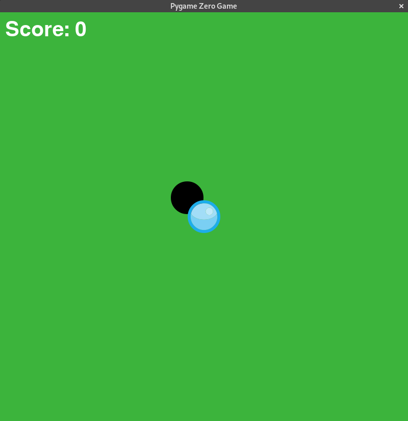

# Push to Hole
---

## Beschreibung

Ein Ball muss mit der Maus in ein Loch geschoben werden. Das Loch ändert alle paar Sekunden seine Position.



## Grafiken


## Programm

``` python samples/push_to_hole.py
```
