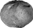
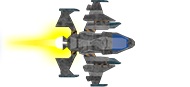

# Asteroids
---

## Grafiken






Quellen:
- Asteroid: [OhjiroChan, OpenGameArt][1], Lizenz: CC0
- Spaceship: [Rawdanitsu, OpenGameArt][2], Lizenz: CC0
- Laser and Thrust: [Rawdanitsu, OpenGameArt][3], Lizenz: CC0

## Programm

```python ./asteroids.py
```


[1]: https://opengameart.org/content/asteroid-tileset-01
[2]: https://opengameart.org/content/some-top-down-spaceships
[3]: https://opengameart.org/content/lasers-and-beams
