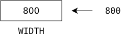

# Anweisung
---

Anweisungen sind die «Sätze» eines Programms oder Skripts. In Python steht jede Anweisung auf einer separaten Zeile. Es werden verschiedene Arten von Anweisungen unterschieden:

- Zuweisung
- Definition Unterprogramm
- Aufruf Unterprogramm

## Zuweisung

Mit einer Zuweisung wird einer Variable ein Wert zugeordnet. Für die Zuweisung wird in Python das Gleichheitszeichen verwendet `=`.

``` python
WIDTH = 800
```
weist der Variable mit dem Namen `WIDTH` den Wert `800` zu. Die Zuweisung darf nicht mit einer mathematischen Gleichheit verwechselt werden. Es ist treffender, sich eine Bewegung von rechts nach links vorzustellen. Der Wert rechts des Gleichheitszeichens wird in der Variable links davon gespeichert:



Die Zuweisung darf nicht mit einer mathematischen Gleichheit verwechselt werden. Bei der Zuweisung wird in der Variable links vom Gleichheitszeichen der Wert rechts davon gespeichert.

Ein gespeicherter Wert kann jederzeit durch eine erneute Zuweisung überschrieben werden. Deshalb sollten Konstanten in Grossbuchstaben geschrieben, um darauf hinzuweisen, dass sie nicht verändert werden sollten.
