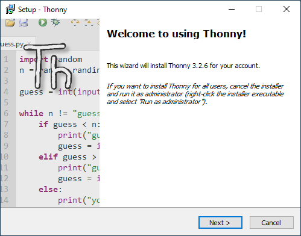
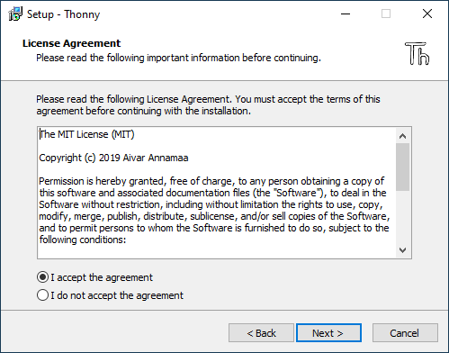
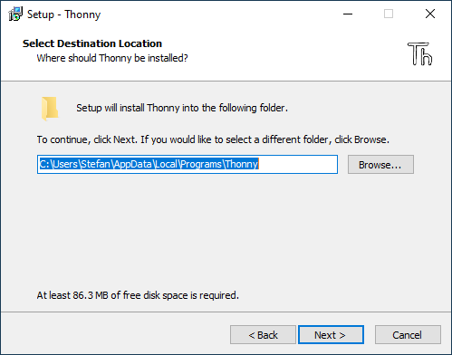
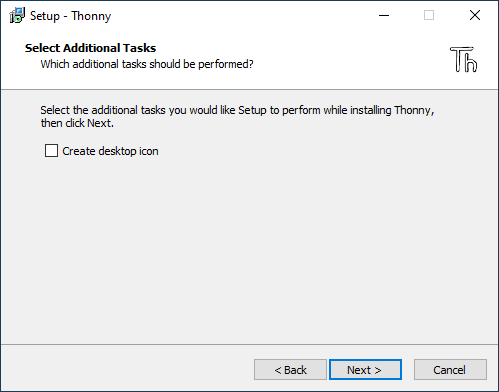
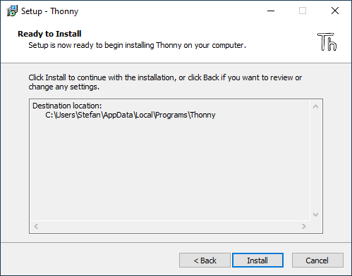
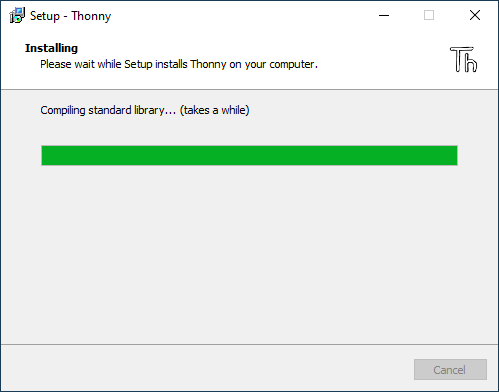
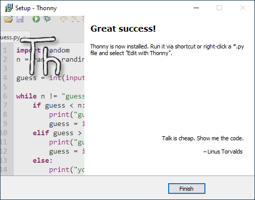

# Installation
---

Auf der Webseite von Thonny stehen Installationsprogramme für Windows, macOS und Linux zu Verfügung:

* [:link: Offizielle Webseite von Thonny](http://thonny.org/)

In den folgenden Abschnitten wird die Installation schrittweise erklärt.

### :mdi-microsoft-windows: Installation auf Windows

Lade Thonny herunter und installiere es:

* [:download: Thonny 3.2.7 für Windows][1]

::: details Installation Schritt für Schritt

1. Lade das Installationsprogramm mit dem obenstehenden Link herunter und starte es anschliessend. Wenn du das folgende Fenster siehst, klicke auf _Next_:

    

2. Klicke auf _Next_:

    

3. Klicke auf _Next_:

    

4. Klicke auf _Next_:

    

5. Klicke auf _Install_:

    

6. Hier einfach geduldig warten:

    

7. Geschafft! Klicke auf _Finish_:

    

:::

### :mdi-apple: Installation auf macOS

* [:download: Thonny 3.2.7 für macOS][2]

Auf macOS kann Thonny auch via [Homebrew](https://brew.sh) installiert werden:

``` shell
brew cask install thonny
```


[1]: https://github.com/thonny/thonny/releases/download/v3.2.7/thonny-3.2.7.exe
[2]: https://github.com/thonny/thonny/releases/download/v3.2.7/thonny-3.2.7.dmg
