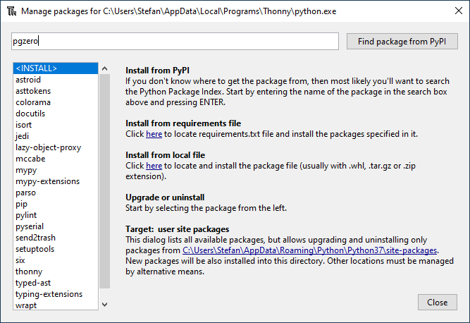
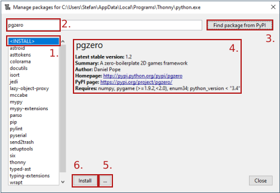

# Paketverwaltung
---

In Thonny können bequem sämtliche Pakete aus dem [Python Package Index](https://pypi.python.org/pypi?%3Aaction=browse) installiert werden. Dazu wird über den Menüpunkt _Tools ‣ Manage packages…_ des Paketmanager geöffnet:

## Neues Paket installieren

Gehe folgendermassen vor, um ein neues Paket zu installieren:

1. In der Liste links den Eintrag _\<INSTALL>_ auswählen.
2. Im Suchfeld oben den Namen des Pakets eingeben.
3. Auf _Search_ klicken.
4. Überprüfen, ob das richtige Paket ausgewählt wurde.
5. Allenfalls auf den Knopf _…_ klicken und die gewünschte Version auswählen.
6. Auf _Install_ klicken.

