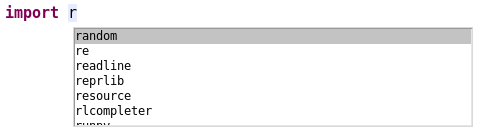

# Code-Vervollständigung
---

Die Code-Vervollständigung (engl. *code completion*) ist ein hilfreiches Werkzeug beim Programmieren, das von vielen Editoren zu Verfügung gestellt wird.

In Thonny kann beim Schreiben des Programmcodes jederzeit die Tastenkombination [Ctrl] und [Space] (Leertaste) gedrückt werden, um eine Liste von möglichen Ergänzungen zu erhalten, welche an dieser Stelle sinnvoll sind. Wenn in den Einstellungen die entsprechende Option eingeschaltet ist, kann auch die Tabulator-Taste [Tab] verwendet werden.

Wenn beispielsweise nach der Eingabe von `import r` die Vervollständigung aufgerufen wird, werden alle vorhandenen Module angezeigt, welche mit «r» beginnen:

Nun kann mit den Pfeiltasten oder der Maus in der Liste der Vorschläge nach dem gewünschten Eintrag gesucht werden. Durch drücken der Eingabetaste [Enter] wird der ausgewählte Vorschlag in den Programmcode übernommen.
