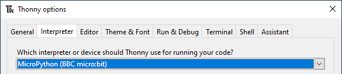

# Interpreter
---

Ein **Interpreter** ist ein Programm, welches Programmquellcode Schritt für Schritt ausführt. In den Einstellungen von Thonny (_Tools ‣ Options… ‣ Interpreter_) kann ausgewählt werden, mit welchem Interpreter man die Python-Skripts in Thonny ausführen möchte.

Für uns sind drei Möglichkeiten relevant:

- _The same interpreter which runs Thonny (default)_: Damit werden Python-Skripts mit dem «normalen» Python, welches mit Thonny installiert wird, ausgeführt. Diese Wahl brauchen wir z.B. für **Turtle**-Programme oder **Pygame Zero**-Programme.

- _MicroPython (BBC micro:bit)_: Mit dieser Einstellung werden Python-Skripts auf einem micro:bit-Mikrocontroller ausgeführt.

- _MicroPython (ESP32)_: Mit dieser Einstellung werden Python-Skripts auf einem ESP32-Mikrocontroller ausgeführt. Diese Einstellung wird im Fach **myGymer Technikprojekte** verwendet.
