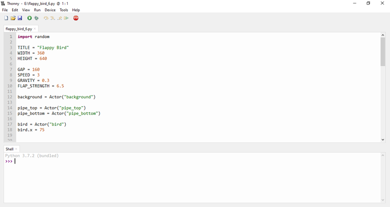

# :reference: Thonny
---

Das Hauptfenster von Thonny besteht aus vier Bereichen:

- __Editor__: Im _Editor_ können Python-Programme bearbeitet werden. Es können mehrere Dateien gleichzeitig geöffnet werden. Für jede offene Datei erscheint ein Tab.

- __Shell__: In diesem Bereich werden Fehler angezeigt, die während der Ausführung eines Python-Programms auftreten. Auch die Aus- und Eingabe von Text durch ein Python-Programm findet in diesem Bereich statt.

- __Variables__: Hier sind nach der Ausführung des Programms die Werte aller im Programm verwendeten Variablen ersichtlich.

- __Object Inspector__: Wenn im _Variables_-Bereich eine Variable ausgewählt wird, werden hier die Details des gespeicherten Werts angezeigt.

Falls einer dieser Bereiche nicht sichtbar ist, kann er über das _View_-Menü eingeblendet werden.
